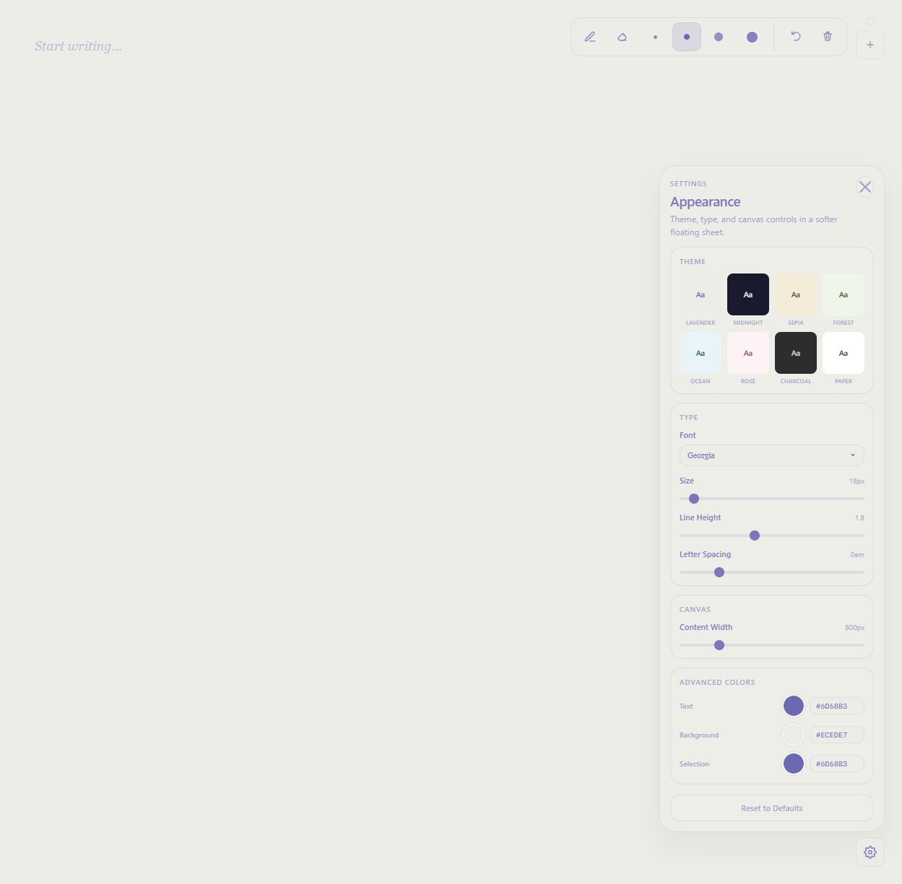

<div align="center">


# Blackboard Text

**A quiet, beautiful place to think.**

A minimalist note-taking Chrome extension with elegant typography,
multi-page tabs, themeable colors, and a freehand drawing layer
that sits right on top of your words.

<sub>Open a new tab, breathe, write.</sub>

<br />


<br />



</div>

---

## ✦ Why Blackboard Text?

Most note tools want to be everything. **Blackboard Text wants to be one thing,
done right** — a clean canvas with thoughtful typography, just enough drawing,
and zero distractions. No accounts. No clouds. No popups. Your notes live in
your browser, sync with your Chrome profile, and are always one click away.

```
┌──────────────────────────────────────────────────────────────────────┐
│                                                                      │
│   Quiet morning thoughts.                                  📝 ✏️ 📖  │
│   ━━━━━━━━━━━━━━━━━━━━━━━                                  ⭐ ✨ 🌙  │
│                                                            ❤️ 🌸 🦋  │
│   The page is wide and the font is large and that's        ☕ 🎂 🎵  │
│   on purpose. Big type slows you down a little.            🚀 💡 💎  │
│                                                                      │
│   • Multiple pages, one per emoji                                +   │
│   • Eight curated themes                                             │
│   • A pen for when words aren't enough                               │
│                                                                ⚙     │
└──────────────────────────────────────────────────────────────────────┘
```

---

## ✦ Features

### 📝 Writing canvas
- Distraction-free contenteditable surface, generous default whitespace
- Word and character counter in the corner — never in your face
- Automatic save with a subtle ✓ indicator
- `Tab` / `Shift+Tab` for indent / outdent

### 🎨 Typography that means it
- **9 bundled fonts** — Unica 77 Cyr · Inter · Inter Tight · PP Right Grotesk (Tight/Reg/Wide) · PP Right Text (Compact/Reg/Wide) · system serifs & sans
- Font preview inside the dropdown (you see the typeface before you pick it)
- Adjustable **size (12–128px)**, **line height (1.0–3.0)**, **letter spacing (-0.05–0.2em)**
- Adjustable **content width** up to 2400px — for ultrawides and tiny phrases alike

### 🌈 Themes & color
- 8 curated themes: **Lavender · Midnight · Sepia · Forest · Ocean · Rosé · Charcoal · Paper**
- An *Advanced* drawer for fully custom text, background, and selection colors
- A real HSV color picker with hue ribbon, swatches, and live hex input
- Selection highlight always matches your text color automatically

### 📚 Pages with personality
- Each page is an emoji — 48 to pick from, or your own
- Drag-and-drop reorder
- Side rail **scrolls cleanly** with soft fade edges when you collect too many
- The active page auto-scrolls itself into view
- `Ctrl/Cmd + N` to add a new page

### 🖌 Drawing layer
- Brush and eraser, with **fine stroke control** (size scales with your font)
- Color follows the theme, or pick your own
- Per-page drawings — switch tabs and your sketches come along
- Undo (`Ctrl/Cmd + Z`) and clear-all
- Coordinates are text-relative, so resizing the window keeps strokes in place

### 💾 Storage
- Pages and content → `chrome.storage.local` (stays on this machine)
- Settings → `chrome.storage.sync` (follows your Chrome profile)
- No network calls. No telemetry. Ever.

---

## ✦ The themes

| Lavender | Midnight | Sepia | Forest |
|:---:|:---:|:---:|:---:|
| `#5B4FA8` on `#F2F0F8` | `#E4DFD0` on `#10172A` | `#4A2E1F` on `#F6EAD3` | `#1F4D2B` on `#EDF3E5` |

| Ocean | Rosé | Charcoal | Paper |
|:---:|:---:|:---:|:---:|
| `#0F4C5C` on `#E0EEF2` | `#7A3B4D` on `#FCEDEF` | `#DDDAD2` on `#1F1F23` | `#1A1A1A` on `#FAFAF7` |

> Every theme defines a text color, a background, and a selection tint.
> Switch themes anytime — the editor crossfades in place.

---

## ✦ Defaults

The new install opens to a deliberate, type-forward setup:

| Setting | Default |
|---|---|
| Font | **Unica 77 Cyr** |
| Size | **40 px** |
| Line height | **1.6** |
| Letter spacing | **0 em** |
| Content width | **1600 px** |
| Theme | **Lavender** |

You can return to these at any time with **Reset to Defaults** at the bottom
of the settings panel.

---

## ✦ Keyboard shortcuts

| Shortcut | Action |
|---|---|
| `Ctrl` / `Cmd` + `N` | New page |
| `Ctrl` / `Cmd` + `Z` | Undo last brush stroke (when drawing) |
| `Alt` + `Shift` + `B` | Toggle brush |
| `Alt` + `Shift` + `E` | Toggle eraser |
| `Tab` / `Shift` + `Tab` | Indent / outdent text |
| `Esc` | Close any open popover (settings, picker, dialog) |

---

## ✦ Install locally

```bash
# 1. clone
git clone https://github.com/Piwqust/blackboard-text.git

# 2. point Chrome at it
#    → open chrome://extensions
#    → enable "Developer mode" (top right)
#    → click "Load unpacked"
#    → select the cloned folder

# 3. open it
#    → click the toolbar icon, or pin it for one-click access
```

The extension opens `editor.html` in a new tab — that's the whole UI.

---

## ✦ Project layout

```
blackboard-text/
├── manifest.json        ← MV3 manifest, permissions, CSP
├── service-worker.js    ← opens editor.html when the action is clicked
├── editor.html          ← markup for the editor, toolbars, popovers
├── editor.css           ← typography, themes, drawing UI, animations
├── editor.js            ← editor state, pages, drawings, persistence
├── icons/               ← extension icons (48 / 128 px)
├── fonts/               ← Unica 77 Cyr + PP Right Grotesk OTFs
└── theme-ui.png         ← the screenshot at the top of this file
```

---

## ✦ Tech notes

- **Manifest V3**, service-worker-based action handler
- **Strict CSP**: `script-src 'self'`, no inline scripts, no remote code
- **Zero dependencies** — no bundler, no framework, no build step
- **Storage permission only** — that's it; no host permissions, no network
- Drawing coordinates are stored in *text-scaled pixels*, so notes survive
  font-size and content-width changes without their strokes drifting

---

## ✦ Roadmap ideas

- Export a page (or all of them) to Markdown / PDF
- Page search across all tabs
- Optional Markdown rendering inside the canvas
- Per-page theme override

PRs welcome — keep it small, keep it quiet.

---

<div align="center">

**Blackboard Text · v1.6.0**

Made for people who like a blank page.

</div>
