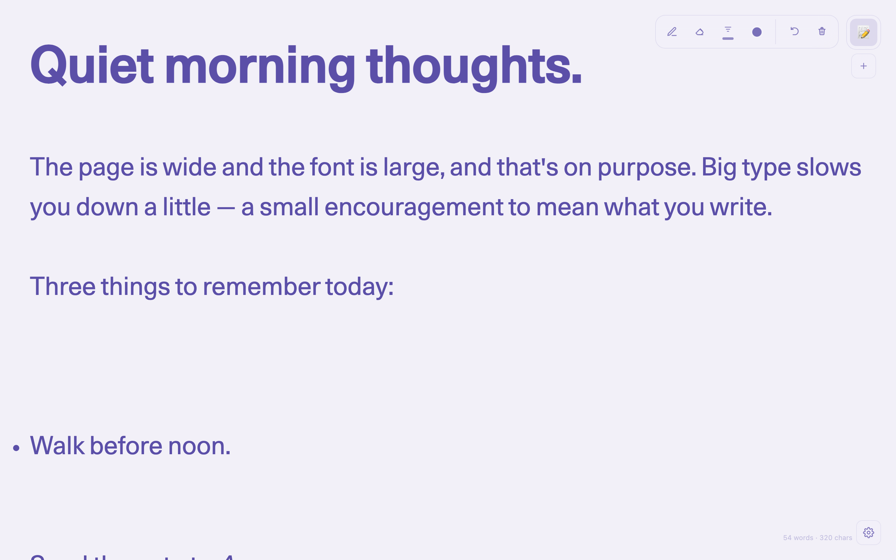
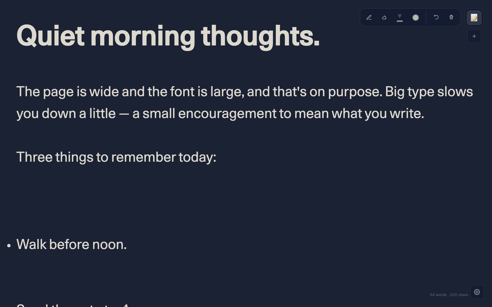
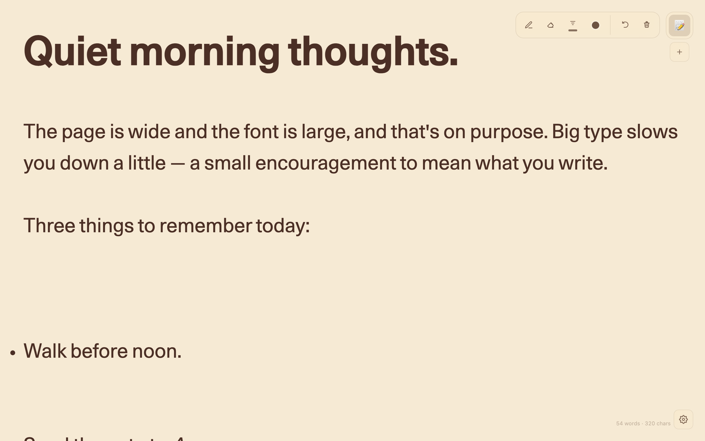
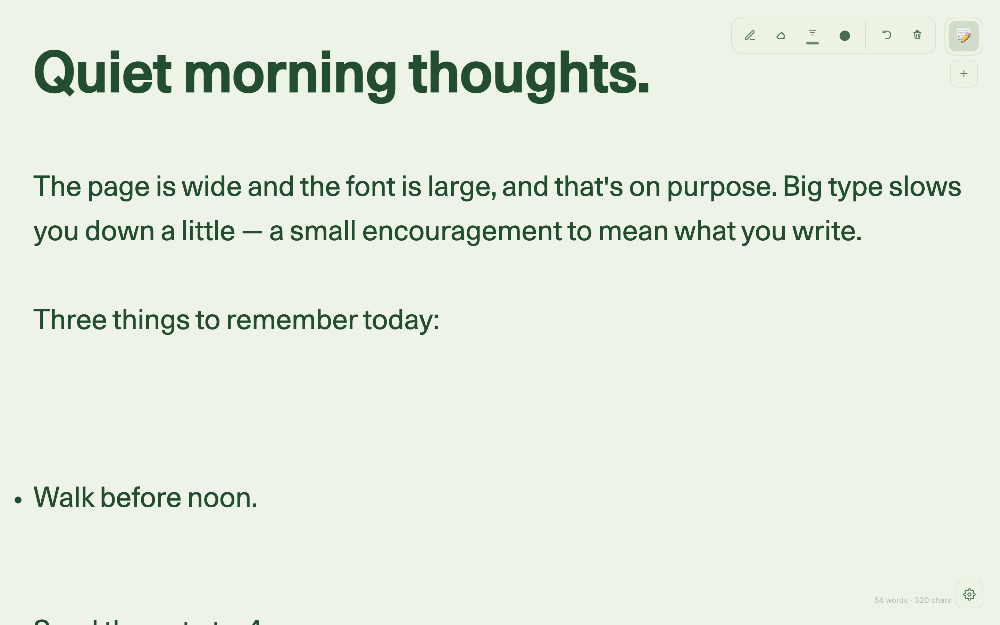
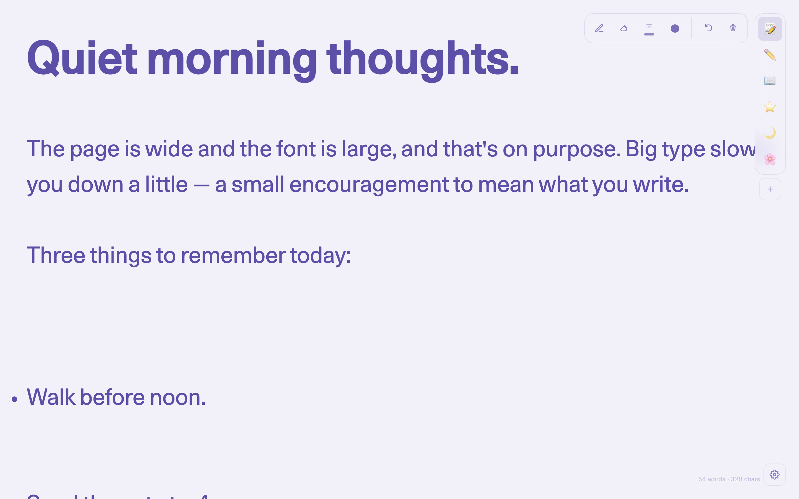
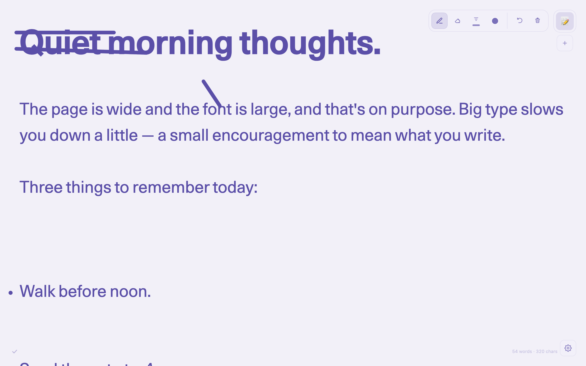
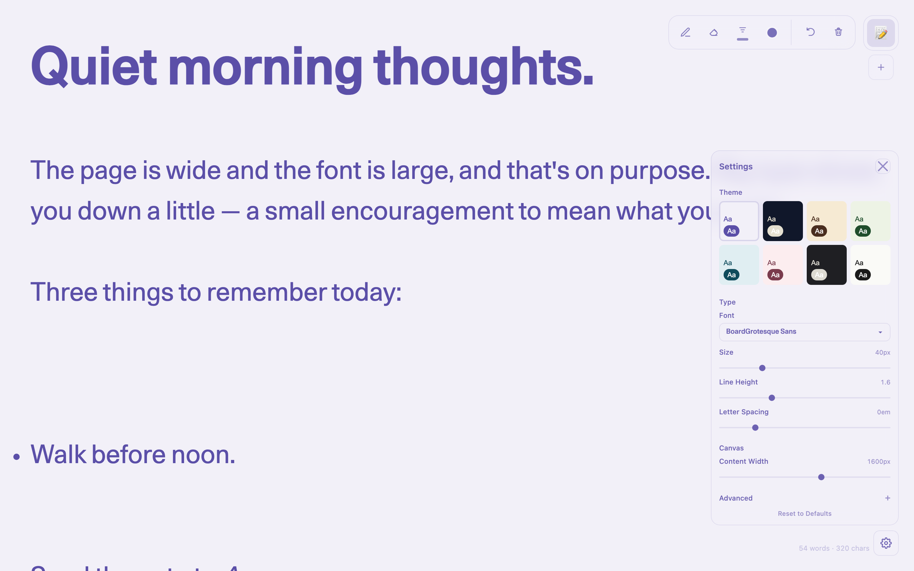

<div align="center">


# Blackboard Text

**A quiet, beautiful place to think.**

A minimalist note-taking Chrome extension — elegant typography, multi-page
tabs, themeable colors, and a freehand drawing layer that sits right on top
of your words.


</div>



---

## ✦ Features

- **Distraction-free canvas** — generous default whitespace, autosave, word + character counter tucked in the corner.
- **Typography that means it** — 3 bundled weights of BoardGrotesque Sans plus Inter / Inter Tight and system serifs/sans, with adjustable size (12–128 px), line height, letter spacing, and content width up to 2400 px.
- **8 curated themes** + an *Advanced* drawer for fully custom text, background, and selection colors via a real HSV picker.
- **Pages with personality** — each tab is an emoji, drag-and-drop reorderable, with a scrollable rail and soft fade edges.
- **Drawing layer** — brush + eraser, fine stroke control, undo, per-page strokes that stay anchored to text when the window resizes.
- **Local & private** — `chrome.storage` only. No accounts, no network, no telemetry.

---

## ✦ Themes



| Lavender | Midnight | Sepia | Forest |
|:---:|:---:|:---:|:---:|
| `#5B4FA8` on `#F2F0F8` | `#E4DFD0` on `#10172A` | `#4A2E1F` on `#F6EAD3` | `#1F4D2B` on `#EDF3E5` |
| Ocean | Rosé | Charcoal | Paper |
| `#0F4C5C` on `#E0EEF2` | `#7A3B4D` on `#FCEDEF` | `#DDDAD2` on `#1F1F23` | `#1A1A1A` on `#FAFAF7` |

<table>
<tr>
<td></td>
<td></td>
</tr>
</table>

---

## ✦ Pages & drawing

One page per emoji, switch in a click, sketch right on top.

<table>
<tr>
<td width="50%"></td>
<td width="50%"></td>
</tr>
</table>

---

## ✦ Settings

Themes, fonts, sizing, and the *Advanced* color drawer — all in one popover.



| Setting | Default |
|---|---|
| Font | **BoardGrotesque Sans** · 40 px · line-height 1.6 |
| Width | **1600 px** |
| Theme | **Lavender** |

---

## ✦ Shortcuts

| Shortcut | Action |
|---|---|
| `Ctrl` / `Cmd` + `N` | New page |
| `Ctrl` / `Cmd` + `Z` | Undo last brush stroke |
| `Alt` + `Shift` + `B` / `E` | Toggle brush / eraser |
| `Tab` / `Shift` + `Tab` | Indent / outdent |
| `Esc` | Close any popover |

---

## ✦ Install locally

```bash
git clone https://github.com/Piwqust/blackboard-text.git
# chrome://extensions → Developer mode → Load unpacked → select the folder
```

The extension opens `editor.html` in a new tab — that's the whole UI.

---

## ✦ Tech notes

- Manifest V3, service-worker action handler.
- Strict CSP (`script-src 'self'`), zero dependencies, no build step.
- `storage` permission only — no host permissions, no network.
- Drawing coordinates stored in *text-scaled pixels* so strokes don't drift when font size or content width changes.

PRs welcome — keep it small, keep it quiet.

<div align="center"><sub><strong>Blackboard Text · v1.6.0</strong> · Made for people who like a blank page.</sub></div>
