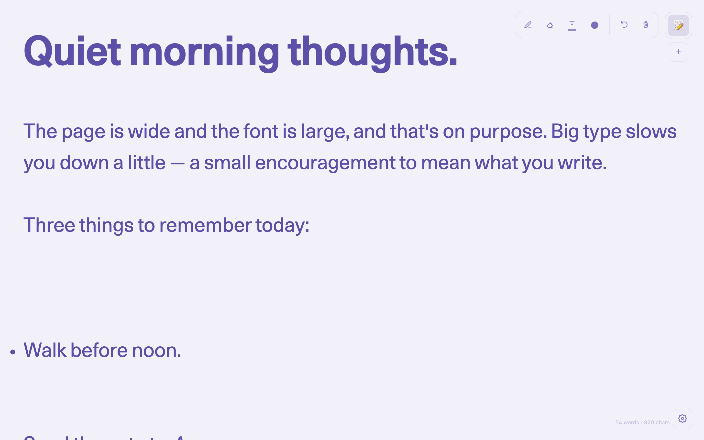

<div align="center">


# Blackboard Text

**A quiet, local-first place to think.**

Write, sketch, and keep your notes in the browser profile you control. No
account, telemetry, cloud database, or note sync service.


</div>



## What ships in v2

- A desktop PWA for Chrome and Edge, designed for GitHub Pages and offline use after the first visit.
- A full Edge extension package for Microsoft Edge Add-ons. The action focuses the existing editor page instead of opening competing writer tabs.
- IndexedDB storage: pages are individual records rather than one giant `chrome.storage` object.
- A single-writer lock. If the same workspace is opened in another tab, the new tab is clearly read-only, so it cannot overwrite the first tab's notes.
- Portable `.blackboard.json` export/import, with validation and a recovery snapshot before every import.
- Recovery snapshots before import, deleting a page, clearing drawings, and restoring a snapshot. The seven most recent are kept locally.
- Existing writing tools: emoji-labelled pages, optional page names, page reordering, custom typography, themes, drawing, undo/redo, and word count.

## Where to use it

| Surface | Intended use | Updates |
| --- | --- | --- |
| PWA on GitHub Pages | Main app for Chrome and Edge desktop | A small **Reload** prompt appears when a new deployed version is ready. |
| Microsoft Edge Add-ons | Full Edge extension | Edge delivers public store updates automatically. |
| Unpacked Chrome extension | One-time migration/export path for older local data | Consumer self-hosted automatic updates are not available. |

The PWA and Edge extension intentionally keep separate local browser storage.
Move notes between them through an exported backup; this avoids accounts and
silent cloud sync.

## Backups and recovery

Open **Settings → Your data**:

1. **Export backup** downloads a `blackboard-text_*.blackboard.json` file.
2. **Import backup** validates the file, tells you how many pages it contains,
   and only replaces the current workspace after a local recovery snapshot is
   saved.
3. **Restore latest snapshot** lets you undo a destructive import, page delete,
   drawing clear, or earlier restore. Restoring itself first snapshots the
   workspace it replaces.

Browser storage can be removed by clearing site data, uninstalling an
extension, or deleting a browser profile. Export a backup before doing any of
those things. See [Privacy](./docs/privacy.md) for the exact data boundary.

## Migrating an existing unpacked Chrome extension

The old extension data is never deleted automatically.

1. In the original unpacked extension folder, update the project files to v2
   and press **Reload** on `chrome://extensions` so the extension keeps its
   existing extension identity and can still read its old `chrome.storage`.
2. Open Blackboard Text. It copies the legacy workspace into IndexedDB and
   leaves the old Chrome storage records in place.
3. Open **Settings → Your data → Export backup**.
4. Open the PWA or install the Edge package, then import that backup there.

Do not expect a newly loaded, different unpacked extension to see the old
extension's storage: browser extension storage is isolated by extension ID.

## Development

Requires Node 20 or later.

```bash
npm ci
npm run verify
```

`npm run verify` runs syntax/JSON checks, core migration and backup tests,
builds both targets, and checks the generated artifacts.

```text
dist/pwa/             GitHub Pages artifact
dist/edge-extension/  ZIP this directory for Edge Add-ons
```

`dist/` is generated and intentionally not committed.

## Publishing the PWA

1. In the repository's GitHub settings, enable **Pages** and choose **GitHub
   Actions** as the deployment source.
2. Change the version in `package.json` and create a matching tag such as
   `v2.0.1`.
3. Push the tag. The release workflow verifies it, builds the PWA, deploys it
   to GitHub Pages, and uploads an Edge ZIP artifact.
4. Visit `https://<account>.github.io/<repository>/` once while
   online. After that, the app shell works offline. Later deployments appear
   as an explicit Reload prompt rather than interrupting unsaved writing.

## Publishing the Edge extension

The package and store-copy draft are ready in this repository, but Edge Partner
Center account verification and the actual public submission are external
steps. Microsoft states that there is [no Edge-program registration fee](https://learn.microsoft.com/en-us/microsoft-edge/extensions/publish/create-dev-account).
Follow [`docs/edge-store-listing.md`](./docs/edge-store-listing.md),
upload the workflow's Edge ZIP artifact with **Public** visibility, then verify
the first store-delivered update with a subsequent tiny release.

## Keyboard shortcuts

| Shortcut | Action |
| --- | --- |
| `Alt` + `Shift` + `N` | New page |
| `Ctrl` / `Cmd` + `Z` | Undo text, or the last brush stroke in drawing mode |
| `Ctrl` / `Cmd` + `Shift` + `Z` or `Ctrl` + `Y` | Redo text |
| `Alt` + `Shift` + `B` / `E` | Toggle brush / eraser |
| `Tab` / `Shift` + `Tab` | Indent / outdent |
| `↑` `↓` on page tabs | Move focus between tabs (`Alt` + arrow reorders) |
| `Esc` | Close a picker or confirmation dialog |

## Licensing

The application code is available under the [MIT License](./LICENSE). Inter
and Inter Tight are bundled under the SIL Open Font License 1.1; see
[`fonts/Inter-OFL.txt`](./fonts/Inter-OFL.txt).
